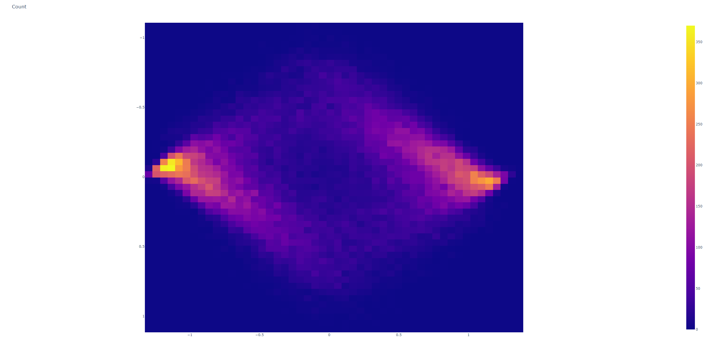
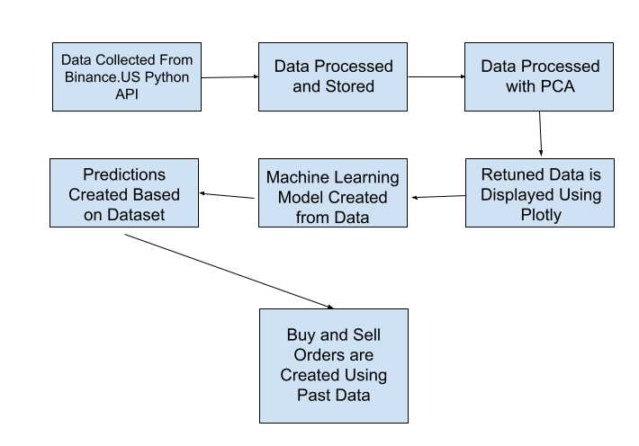

# Introduction

The project is a working Python program that uses Principle Component Analysis (PCA) to evaluate potential times to create buy and sell orders. The program uses the Binance API to collect real-time data stored in a file. The file is then organized into columns that then can be called for future use. Eleven different data points were being looked at in this research. Later in the paper will discuss and justify why these eleven data points were chosen. The data is then pulled from the file. It is applied to the PCA model where the eleven values are reduced into values that can be placed on a graph. 

Graphs are then created to display the information collected on the cryptocurrency. Using Plotly graphs, the program can create graphs to display the mean and distribution of positive and negative values. From this, a user can determine the best times when to invest and when not to. This is important because any edge trading in the market will lead to a competitive advantage causing potential monetary gain. It is a possible solution to accurately analyze the market.

Challenges have arisen throughout this research. For instance, deciding how large of a research project that could be made. Looking through what other people had researched, narrowed down the CoinComplete research data so that this research could focus on the data with the amount of time allotted. Problems occurred throughout this research since it is new technology. There is not much information on how to work with some of the packages implemented into CoinComplete tool. For this reason, most of the research time was figuring out how the tools worked. Combining them all also large posed a challenge as well.

The ethical considerations for this project include how this would affect the market. Having something that was proven successful like this could lead to an unfair advantage. This would, if done on a large enough scale, could disrupt the market that the program had studied. This would make the program not invest based on the new market but invest in the one it had studied. This might cause problems with the program. Another ethical consideration is how users would overuse a system like this and potentially crash the entire network. If something like this became too popular and the Binance infrastructure is unable to support the traffic, it could lead to issues. Looking at these issues closely in the paper will reveal how these were addressed issues in the research.

## Completed Work
### Binance API and Data Collected

The Binance API offers a lot of tools for me to work with to gather the necessary data. To connect to the Binance API, a developer account is first needed to connect to their servers. To apply for this, it is required that a user must make an account and submit a form. Once the form is submitted, it is accepted and a programmer can use the tool. When a new project is created through Binance, an API key, and secret key are generated to identify the tool. These keys are added to a Python script that holds them so they can be accessed by the main Python program. Both of these keys ensure secure access to the Binance servers where traffic and queries can be tracked. 

It is important to note the limitation of the API as well. There is a 1200 request per minute limit. Also, ten orders per second limits the number of requests that can be made. This has to be considered when making a program. A program must not call the API server too often otherwise data will stop being sent. A timer needs to be implemented into the program so that the program will only call the servers so many times a second. Depending on the number of requests the program has, the number of seconds between requests must be changed. 

It is also good practice to close the connection to the API server when the program is finished running. This prevents the connections from staying open and the Binance server from constantly sending the same data repeatedly. The open and close times of the K-lines are used to separate the different times in the data from each other. Data collected is then simplified with all of the open and close times. This concise data can be broken down into specific time segments. 

Working with the API allows for a multitude of information to be gathered. For instance, the candlestick charts that are displayed on their website can be gathered. This allows for a lot of data to be collected from the market. Market open values can be gathered in USD so they can be stored for later. Gathering this data allows for marking the opening price of the market during that K-line. 

Another variable that is collected is the high price of the K-line. This is needed so that the program can determine the times of the highest price during the given period. The low is also needed so that it can be compared to the high. They are used for calculations later in the program. USD close price is also needed so that it can be compared to the open price. This is also used later in the machine learning algorithm. 

The volume of the trades is something that is also collected from the Binance API. This is necessary to see the total number of contracts that were exchanged between buyers and sellers. It is important to collect this information because it is a measure of the market's activity and liquidity. This is also important because, on coins that are traded less often, it is important to know the size of the data collected. The quote asset volume is also something that must be collected from the API. This tells us the amount of money the payer sent during a transaction. 

It is important to note that this is before the transaction fees of the exchange are taken out. This also is another good indicator of a crypto’s liquidity. Something else that the program needs is the number of transactions occurring on the network. It is important to take this information into account since it indicates how active the coin is. This is something that is used when displaying the hours that are the frequently most traded. It is something that also is a good indicator of the liquidity of the coin. 

Another variable that is useful to study market information is the Taker Buy Sell Volume ratio or TBBAV. This is a great indicator that the market is rising or falling. Say, for instance, the value returned is over one, this would mean that a buyer has bought someone else’s coins. It indicates that more buyers are willing to pay more for coins. This means that it is a bullish sentiment telling the program when a good time to invest is. Values under one show that more people are selling coins rather than buying. This means that the price of the coin is being driven down due to fewer people buying. This indicates a bearish sentiment for the program. It is a time when it is not best to invest. 

The final thing that is collected from the Binance API is the total buy quantity. The data shows the total number of bought coins and buy orders on the marketplace. This is another great indicator of liquidity. It shows if a coin is active or not. Collecting this data is important because later on it can be used in the machine learning algorithm to learn the market.

The sample returned data from Binance API as described above.

### Sorting and Cleaning Data
	
The first thing that is done to the data is that it is stored. The file is generated specific to the coin the data is from. This makes it easy for humans to read the data if they wanted to do it manually. The data is added to the CSV files and given column header names. These names are used to also help the files become more human-readable. This also doubles as column header names that the program can work with later on. 

### Working With the Data

Once the data is gathered from the Binance API and normalized, it can now be used in the program. The files are first read into the Python program. This is done each time separately for each coin. This allows us to control over seeing a coin’s market data specifically. It is an important step of the program which allows the separation of coins so that markets can be studied individually. The program takes a few seconds to preprocess the data. Once this is done, data must now be loaded into data frames. For variables like open time and close time, it is also necessary to do a little preprocessing. This is because the data collected off of the Binance API is not the easiest for a program to read. The data must be normalized first into a standard format so that it is easier to work with the data later. The same thing must be done for the variable time too. However, this is something that just cannot be pulled from the Binance API. First, the open variable is added to the respective hours that have passed since the last check. This is then divided by the close time. This gives the data frames something to reference when going back to check the data.

The machine learning algorithm can now be loaded with data. Using the sklearn package we can use some machine learning algorithms without doing much of the behind-the-scenes work. This is nice because it is just another thing that does not have to be on implementing by hand. Loading the data is as simple as taking the data frame and shoving the data into it. From here, we are first able to start working with the PCA model. It is important to note what the Principle Component analysis model does. 

It first starts by normalizing the data. While we had already done this before, it must be done again so that none of the data points will dominate over another. This is necessary so that the information that we collect is not skewed. The next step is a covariance matrix computation. This is so that we can see if there is any correlated information between the points. So the program applies the data to the matrix. In the program, it is important to note that we are only storing two components in the matrix. The covariances tell us about the data a few things. If the number is positive, the two data points increase or decrease with each other. However, if it is negative, one would increase while the other data point decreases. This highlights the correlation between the pairs. 

The next step of the PCA model is computing the eigenvectors and eigenvalues. It is important to note that there is an issue after the principal components are created. Most of the data points are compressed into the first component. This is because most of the data is not correlated with the initial data. However, it is important to organize the data this way because it is a great way to reduce the dimensions of data without losing much information. Discarding the low-correlated data removes a lot of noise in the data. The PCA model constructs the principal components by first looking at the largest possible variance. It then checks perpendicularly for the next highest variance. This does this for all of the numbers of variables. In the two-dimensional matrix now, we can rank the eigenvalues. This is done by dividing the eigenvalues of each of the components by the sum of the eigenvalues. This is done for all of the data points.

PCA provides dimensionality-reduction great for the data being used in the CoinComplete research. 

Now that the eigenvalues are in descending order, it will allow the program to find the components in order of significance. Each of the eigenvectors is transformed in the program. This is so that each component can be filtered by usefulness. The eigenvector with lesser significance will be removed from the PCA model. It is important to note that doing this does create some data loss. While this is important to take into consideration, the amount that was lost is not a relevant problem. 

The final step of the PCA model is the recast the data along the component’s axes. This is done to reorganize the data so that it corresponds to the original axes. It is important to do this so that graphs can be compared to each other over time. Once the data is standardized, we can not work on displaying the information. This step is very important as these models can help a user determine an optimal target zone of data to train the model on later.

### Displaying the Information

Once the PCA model is complete the data is ready to display in a human-readable format. This is done using a custom graph using the Python package Plotly. This is a great tool is visualize the data in an easy-to-read format for the tool’s user. The first graph that is generated is the mean of all of the data. This is a good way to figure out what the averages of all of the points are. The next graph that is generated is the median. This is also good to visualize the data. The third and final graph that is created is the graph that is the most useful to visualize the data. This graph shows the points when investing during that time frame would be profitable or not. This is shown as a heat map where the times that a person would have made negative money on the left and positive money on the right. This can be viewed and worked with to determine the most efficient and effective way to invest.

This graph is basic as it just displays all of the points the PCA model returned. While a good start, there are better ways to display the information. X is the amount of profit/loss, and Y is profit/loss.

This graph is more comprehensive than Figure 3. This represents the data in a more concise way for a user to view. The right side represents the times when if someone would have invested they would have made money. The inverse is true for the left side. X is the amount of profit/loss, and Y is profit/loss.

## Motivation

The motivation for the project is the increasing presence of cryptocurrency in our world. As technology develops, more and more uses for it are discovered. Early research and development of tools like this are both cutting-edge. Cryptocurrency markets behave similarly to traditional stock markets. However, they are much more volatile as trading never stops. Research like this stands to gain a better understanding of how these markets work. Bitcoin prices have grown more than 120% in 2016, reaching a level of more than $20,000 from $900 in the year 2017 [@akyildirim2021research]. As such, it has been experiencing an increase in possibilities for investors to make far greater gains than any other financial asset class.

This shows that there is a future in cryptocurrency. This is indicated by the increase in the use of BTC, LTC, XRP, and ETH [@akyildirim2021research]. 

There are several real-world potential justifications for creating a cryptocurrency prediction machine learning program to study the market. One is that it could help investors make more informed decisions about when to buy or sell different cryptocurrencies. Another is that it could help traders identify patterns and trends in the market that they might not otherwise be able to detect. Additionally, a machine learning program could potentially be used to analyze large amounts of data more quickly and accurately than a human could, which could lead to more accurate predictions prices of different cryptocurrencies.

Using Principal Component Analysis (PCA) in conjunction with a machine learning model for cryptocurrency prediction could be beneficial in several ways.

PCA is a technique that is used to reduce the dimensionality of a dataset by identifying the underlying patterns or features that explain the most variance in the data. This can be useful in the context of cryptocurrency prediction because it can help to identify the most important factors that influence the price of a given cryptocurrency.

By incorporating PCA into the machine learning model, the model may be able to learn from a smaller set of features, which can improve the model's performance and reduce the risk of overfitting. Additionally, PCA can help to identify correlations between different features in the dataset, which can help to identify which features are most important for making accurate predictions.

Therefore, using PCA in conjunction with a machine learning model for cryptocurrency prediction can help to improve the model's performance by reducing the dimensionality of the dataset, identifying the most important features, and uncovering the underlying patterns or relationships in the data.

## Goals of the Project

The goal of this project is to predict and forecast the close price of Ethereum and Bitcoin. This will help reduce risk in the cryptocurrency market. The data will be collected and analyzing historical data from https://binance.us/ to find patterns that can be used to make predictions about future prices. Because these currencies are highly volatile, it may not always be possible to model their respective data accurately using a PCA model approach alone; this is why exploring multiple graphs and ways to represent the findings throughout the paper.

Implementing a machine learning model also attempts to remove risk in a market by aiding a user in creating buy and sell orders on these coins. By doing this, it relieves the stress on the tool's user to constantly have to make their current market predictions. Machine learning can be used to optimize an investor's portfolio by suggesting an appropriate asset allocation based on their investment goals, risk tolerance, and market current conditions. This helps investors to diversify their investments and maximize their returns.

A great way to evaluate this is to look at the return on investment (ROI) for a given investment strategy. For example, if an investor uses the tool to make predictions about the price of a particular cryptocurrency and then buys or sells that cryptocurrency based on those predictions, the ROI can be calculated by comparing the final value of the investment to the initial investment. A higher ROI indicates that the model is helping the investor to make more profitable trades. This would make this tool viable in investment strategies.

## Ethical Implications

One of the Ethical considerations of this tool is that machine learning models can be used to make predictions prices of cryptocurrencies, they can also be used to manipulate the market. For example, a group of investors could use a machine learning model to make predictions about the price of a particular cryptocurrency, and then use that information to manipulate the market and make a profit. While examples of this have happened before in the stock market, it is almost guaranteed that it will happen in the cryptocurrency field.

Another ethical implication is that using the PCA technique reduces the dimensionality of a dataset, but it can also make it more difficult to understand how the model is making predictions. This lack of interpretability can be a concern when it comes to making decisions about financial investments, as it can be difficult to know whether the predictions made by the model are accurate or not. It also makes finding any specific issues with the data challenging as all of the values are combined.

Another problem with technology like this is overuse. While a few people doing research does not affect the market, if a tool like this was used by enough people, it could cause the market to become even more unstable. This would be because if everyone was being told to invest and withdraw their money at the same time, it breaks the market. While this problem would kind of take care of itself. This is because the market the program is built for would no longer exist making the tool obsolete. This is something that is again very unlikely, but worth considering. A great way to work around this is to make this open-source and available to everyone. If no one owns this technology, no one person can profit from it.

With the heavy increase of cryptocurrency attention, it has also drawn the eyes of the government. If market regulations were put into place in the future, with would without a doubt change the market forever. The use of PCA-based models for cryptocurrency prediction may be subject to regulations, and it is important to be aware of and comply with any relevant laws or regulations created in the future.

# Related Work
## Positive Research Findings

One of the related works that have taken a look at was the research done by the Annals of Operations Research team. The study used machine learning to take a look at twelve different coins. Using four different classification algorithms, it predicted future market activity. They found from this that they were accurately able to predict future market activity 70% of the time in the short term [@akyildirim2021research]. This proves that a profitable algorithm is achievable. This study was reviewed for the research and applied similar techniques to analyze. For instance, when considering the data that was needed to collect, consulting this study was valuable in the CoinComplete research. In the study, Using machine learning for cryptocurrency trading, the scope of the research looked at different Twitter and market activity for Bitcoin, Ethereum, Ripple, and Litecoin [@sun2019research]. This study used a neural network to determine market indicators. They found that it was able to accurately predict market activity using this data. What was found interesting about this study is that each of the different coins had different success rates. This demonstrates that different coins have different social environments that could be hard to predict. Another thing to note is that the market activity and social indicators are combined. This leaves some questions about what affects the market. This study influenced the CoinComplete research when determining the scope of this project. Deciding that this project should be to narrow down this research to market activity. 

The CoinComplete project was influenced by the study, Forecasting cryptocurrency prices time series using a machine learning approach, due to the fact it was doing a different machine learning model. The study took a look at collecting the data and using a Binary Auto Regressive Tree (BART) instead of a PCA model like in this one [@vasily2019research]. It took a look at Bitcoin, Ethereum, and Ripple. The study found that the longer the data set the model was predicting, the more accurate it became. This made me consider the time frame that was needed to focus on this project. This research helped me decide it was necessary to focus on more short-term predictions. While something like this has been proven to be effective in the run, the CoinComplete research is more focused on short-term profit. Creating a tool to see if it would be profitable to trade with a trading algorithm in the short run. The article, Machine learning algorithm for cryptocurrencies price prediction, demonstrated that it was possible to predict future market activity using machine learning. It used Long Short-Term Memory (LSTM) to build the cryptocurrency price prediction model [@awotunde2021research]. In the closing notes for the study, it takes about future work that could be done to improve their research. This was considered in the CoinComplete research. For example, it helped determine what machine learning model was used in this research. Also, to rescope this project to improve the effectiveness of understanding the market activity. Introducing structure to the way the data is collected removes uncertainty in the volatility of the market.

The project, Machine learning in the cryptocurrency market, helped me figure out the scope of the CoinComplete project. It studied 1,681 currencies using two different models. The first one was long short-term memory models which it was found to be effective at predicting. The other was a Batesian neural network [@alessandretti2018research]. While this study found that machine learning was able to predict market activity, it looked at way too many subjects for this research here in this project. Just to keep the scope of the project doable it was decided that this research would focus on just two currencies. It also made me take into account transaction fees when trading. This is important because it is something that must be overcome if profitable trading is going to be achieved. Deciding that this is something that would be examined in this research and tool. 

The cumulative returns obtained under the Sharpe ratio optimization (a) and the geometric mean optimization
(b) for the baseline (blue line), Method 1 (orange line), Method 2 (green line), and Method 3 (red line). Analyses are performed considering
prices in BTC [@akyildirim2021research].

The research paper, Ascertaining price formation in cryptocurrency markets with machine learning, looked at short-term trading with machine learning algorithms. It used a Long-Short-Term-Memory model to take in data and create price predictions. The findings from using this model were that it was 78% effective at predicting the market [@fang2021research]. One thing that was noted was that due to the scope of the research, the neural network did not have much data to train on. This is possible could lead to incorrect financial predictions. To deal with this in the CoinComplete research, this tool will look at multiple days at multiple times to gather as much information as possible. Incorporating this idea will lead to a more thorough understanding of how market activity is affected. The research paper, A deep learning-based cryptocurrency price prediction scheme for financial institutions, focused on only two currencies, Litecoin and Monero. However, it was noted in the paper that this research could be adapted to other cryptocurrencies. It looked at the viability of using two different machine learning models Recurrent Neural Network and Long Short-Term Memory. Both were applied to both of the coins. The study found that the proposed schemes can accurately predict prices[@patel2020research]. This was promising research as it proved that it was possible to have a model that predicts and trades profitably. Learning from this article helped me apply it to this research project. For instance, considering the time frame that was allotted for this research project and tool. This led to me wanting to work on more of a short-term project that looked at price predictions.

The study, Predicting Ethereum prices with machine learning based on Blockchain information, differentiates itself by taking just a look at Ethereum. It used machine learning models to reveal that it is possible to predict Ethereum prices using economic factors. The study noted that Ethereum and Bitcoin have different movement patterns. This would create a difference in the techniques needed to predict currency prices. The study also found that maco-economic facts significantly improve the prediction accuracy of Ethereum prices [@kim2021research]. Two different machine-learning techniques were applied to the data. From the findings, the researchers found that trading with consideration of Blockchain information was profitable. This is something that was considered for this research. Being able to learn from this to be able to choose the variables needed for this research. The paper, Comparative performance of machine learning algorithms for cryptocurrency forecasting, had a strong focus on studying the performance of machine learning algorithms. The researchers looked at six different cryptocurrencies to study the market data. It compared Support Vector Machines (SVM) and Artificial Neural Networks (ANNs). SVM was proven to be the most accurate in being able to predict market movements at 95.5% accuracy [@hitam2018research]. This study proved that by using machine learning, it is possible to predict future price movements. Adapting what they learned in this research from the experiments, including the option of the machine learning algorithm was necessary. After careful consideration, it was decided to also include this research with a machine learning algorithm.

## Research That Failed

The article, An approach to predict and forecast the price of constituents and index of cryptocurrency using machine learning, takes a look at Bitcoin, Digital Cash, and Ripple and uses four different neural networks to forecast the price. Most of the models were not that successful at predicting market activity [@chowdhury2020research]. However, one model was 92.4% accurate at creating profitable trades. This paper made me consider what to look at when gathering data for CoinComplete to use for predictions. For instance, it made me look at different variables that would be included in this research. Different models had varying successes but all used the same variables. This means that this can be translated into a different model for its use of it. This research made me consider what to include and take a look at for this project. Automated cryptocurrencies prices prediction using machine learning looks at a few different currencies using a Long Short-Term Memory model. This study looked at the short-term viability of predictions. After studying seven cryptocurrencies, the researchers determined that if they used more information, the study would be more accurate. While their findings did show that their machine learning algorithm was able to predict at a much higher success rate than random, some data for currencies were limited [@mittal2018research]. Due to the trading volume of smaller coins, it makes it harder to study market data when there is less of it. This made me consider what coins were wanted to use in this research. Using coins with enough trading data is important because it allows me to have enough data to make accurate predictions.

### Research Reviews

In the research called Past, present, and future of the application of machine learning in cryptocurrency research, the researchers conducted a review of multiple different machine learning algorithm research papers. This offered a unique approach because it was coming from more a general point of view. Many different machine-learning models were studied and the paper discussed the strengths and weaknesses found in different models. This was very important when considering the model that was going to be used for this research. An important thing to take away from this paper is to find that some research papers’ models were overfitted with their variables [@ren2022research]. This will lead to invalid predictors and wasted computational resources. It also makes the model less portable. The study found that there was a severe generalization of data in most machine-learning research studies. Taking this into careful consideration when developing what variables were needed to be included in this research. 

Another important study for this research was the Price Movement Prediction of Cryptocurrencies Using Sentiment Analysis and Machine Learning This study used basic techniques to calculate whether to invest in the market or not. This research considered social implications by scraping Twitter as well. The study used basic machine learning and social influence to measure a way to create an indication. It took a look at BTC in the research. This study found that it was not more accurately able to predict than randomly investing [@valencia2019research]. This research considered this when creating this computational artifact. Originally, the tool was going to develop a similar web scraping tool to gain a better understanding of when people were going to invest. These, however, along with other studies provide enough evidence to conclude that monitoring social indicators does not translate well to predicting the market. Eventually deciding to cut this part from this research.

### Existing Tools

It is important to note that there are already existing tools of its kind. Since the recent crypto boom, people have been looking for ways to try and predict the market. What CoinComplete tool does is further this understanding of the market. Gaining more information about a topic will lead to better predictions in the future. 

#### CryptoPredictions.com

This is a website that uses machine learning algorithms to predict the prices of different cryptocurrencies. It's not a specific tool, but a website that provides predictions of the cryptocurrency market based on historical data and ML models. The website provides predictions for a variety of cryptocurrencies, including Bitcoin, Ethereum, Litecoin, and others. The predictions are generated using a variety of machine learning models, such as neural networks and support vector machines, which are trained on historical price data. What is not necessarily to be taken as financial advice, it does offer a very good model of where the markets will go.

#### Crypto-ML

Crypto-ML is an open-source Python library for implementing machine-learning models for cryptocurrency trading. It provides a set of tools and modules for building and testing trading strategies using machine learning techniques. The library allows users to easily access and manipulate historical cryptocurrency market data, as well as implement and backtest trading strategies using a variety of machine learning models, such as neural networks, decision trees, and linear regression.

It is designed to be user-friendly and easy to use, even for those with little to no experience in machine learning. It also provides pre-built models and strategies which can be used as a starting point for users looking to develop their trading strategies. This can be a useful tool for researchers, data scientists, and traders interested in experimenting with machine-learning techniques in the context of cryptocurrency trading.

# Method of approach

## Similar Tools

## Comparison Metrics

Comparing CoinComplete based on seven different metrics against 6 different other tools, it is overall a more comprehensive tool. The qualifications for these metrics are explained below.

### Paywall/Limited Usage

The criteria used to measure this is based on if the tool requires a premium subscription or payment to unlock the full features of the tool. Many tools offer very limited access to their tool without paying a fee. Another thing to note is that when transactions are conducted on an exchange, tools also sometimes take out a percentage fee on top of the exchange fee. This cuts into profits heavily and while it may look like a user is trading profitably, in reality, it does not make the user much return on their investments. For this reason, if any of the tools incorporate a fee or payment that is more than the exchange's base rate, the tool receives a dot indicating the additional cost to the user to use the tool.

### Trading Configurability

The trading configurability of a tool is measured by the ability of a user to be able to configure the trading algorithm being used. This metric is classified by being able to change the hyperparameter, how far a tool predicts into the future and, what the sequence length the model trains on. This is an important feature because it allows to user to micromanage the model. This feature is especially important when a user is trying to target a specific market segment and train the model on it. Many tools do not offer this feature like CoinComplete. Often limiting users to presets in the tool that is not able to change. Having this feature is necessary since it allows experimentation with refining the model to specific market conditions. If a tool supports this functionality then it receives a dot.

### Data Selection Tool

The data selection qualification is based on if a tool allows a user to select the data the model is being trained on. While some tools have different approaches to the data they collect, this is a metric to indicate if a user can select the data themselves. If a component of a tool allows the user to select the data the model is trained on, then the tool revives a dot indicating this. In the case of CoinComplete, a PCA tool is incorporated to allow users to see the data they collected. If a tool incorporates a component like this, then it receives a dot to indicate it has one.

### Multiple Exchange Support

This metric indicates if a tool supports multiple exchanges to conduct crypto transactions. Many tools also require a user to pay for access to more than one exchange. This metric is specifically looking at the free version (no additional cost to the user) of the tool and if it allows transactions to be conducted on multiple different exchanges. If it meets these requirements then it receives a dot.

### Performance Metric

The performance metric is defined by the tool's ability to quantify the performance of the model that is being used. For instance, if a tool quantifies the number of times the model was successfully able to make trades that were profitable then it receives a dot. Also, if the tool quantifies the actual prediction amount as MSE or RMSE it would also receive a dot.

### Unlimited Backtesting

This metric is defined by a tool's ability to test the model in an environment where the transactions are not conducted on the live market. This means it can simulate these transactions in a closed test environment. This metric also takes into account if this service of the tool is included in the free version. While some tools offer this, other tools also require a user to pay for this service. Also, some services only allow so many tests to be conducted on their solution in a single month. If the service allows unlimited testing of the model and does not require additional payment for the service, then it receives a dot.

### Same Time Coin Trading Support

This metric is defined by the ability to have a model set up and also be able to use the tool on multiple currencies at the same time. Some tools only allow one coin to be actively traded at one time without paying a subscription or a fee to trade more than one coin at a single instance. This metric is looking at the free version of the tool and if multiple coins can be trained and traded live. If the tool meets these requirements, then it receives a dot.

## Pionex Crypto Trading Bot Tool

Pionex is a popular cryptocurrency trading bot that provides automated trading and analysis tools for users. While it has many benefits, there are also some drawbacks to using Pionex as a trading tool. It is a product that requires a subscription fee to use. This tool does not have a free version. Unlike CoinComplete which is free tool. 

A limitation of the tool itself is its lack of transparency. The platform operates as a black box, which means that users do not have access to the underlying algorithms or trading strategies. This can make it difficult for users to understand how the platform is making trades and to assess its performance.

Maintenance is also a consideration when using Pionex. As a proprietary platform, users are dependent on the provider for maintenance and updates. This can be an issue for users who are looking for a more flexible and customizable solution. Unlike the CoinComplete tool which is static, and does not change unless decencies are changed.

The dashboard offers a lot of information at first glance. In the bottom right, different preset trading bots can be seen. Note this is the paid version.

## Gekko Trading Tool

One of the major cons of Gekko is its complexity. The platform is designed to be used by experienced traders and developers and may be challenging to use for those who are not familiar with cryptocurrency trading or programming. The platform requires a certain level of technical expertise, which can be difficult for inexperienced users to attain. Integration is also a concern when using Gekko. Integrating Gekko with other trading platforms can be difficult, and the platform may not be compatible with all platforms. This can limit its ability to be used as a comprehensive trading solution. This is unlike CoinComplete where any coin on the Binance.US trading platform can be accessed easily.

Another limitation of Gekko is its limited scalability. This means the platform is designed to work with smaller trading accounts, which can limit its ability to work for larger accounts. What is meant by this is that only a few "bots" can be created on the tool at a time. When trying to test out new strategies, this is not something beneficial. This means that users who are looking to trade with larger amounts of money may need to look for alternative solutions. The tool developed for this project can be scaled to trade as much as is wanted. Since the tool is connected to a user’s Binance account, any order manually able to be done can be done automatically. 

Most of the important information needed to create market predictions is also kept behind a paywall. Gekko Plus offers a lot more information than what is included in the free version. Since the CoinComplete project is free and offers all of this data for free, this tool will allow people not willing to pay a monthly subscription fee to conduct market research. The tool’s creator also is no longer updating this tool. This creates a limited lifespan of the product. This is unlike CoinComplete where it is only limited by the Binance.US API. Providing dependencies do not change, CoinComplete tool should continue to work.

The tool offers an easy-to-use interface. Very few presets are offered so the creation of a trading algorithm is needed.

## freqtrade

Freqtrade is a free open-source trading bot platform designed for cryptocurrency traders. It is accessed through a telegram chat. Commands are inputted through this group chat. The platform is widely used by traders for its advanced features, flexibility, and ease of use. Freqtrade offers users a crypto tool that is free without limited functionality. Freqtrade also has a lack of trading configurability. This means that Freqtrade takes care of the trading strategy for the user. This is not ideal for some traders that may prefer to have more control over their trades. Additionally, it offers a data selection tool that enables users to customize their trading strategies based on specific indicators or data points. This feature allows users to refine their trading strategies and make more informed decisions about prediction algorithms. It is important to note that multiple exchange support is another feature of Freqtrade. The platform supports many popular cryptocurrency exchanges including Binance, Bittrex, Gate.io, and Kraken. This allows users to trade across different markets and take advantage of different coin's market activities. 

Something else that is included in this tool is the performance metrics that are critical for traders. This tool offers a comprehensive set of metrics that allow users to analyze their trades and make informed decisions. These metrics include profit and loss, return on investment, and win rate, among others. Unlimited backtesting is another feature of Freqtrade. Users can backtest their trading strategies on historical data, which allows them to see how their strategy would have performed in the past. This feature helps users to optimize their trading strategies and make better decisions for live market transactions. Freqtrade offers same-time coin trading support. This feature enables users to trade multiple coins simultaneously, which can help them to diversify their portfolio and reduce the risk of over-trading a single coin.

## Superalgos

Superalgos is a cryptocurrency trading platform designed to help users make better trading decisions through automated trading strategies. One thing to note about this tool is the lack of a paywall for its features. This tool, unlike others, does not restrict access to some of the advanced features and functionality of the platform. This tool is very community oriented making it an accessible option for entry-level traders. However, it is important to note that a user must hold some project coins to be able to access this community market. This tool also lacks trading configurability, which may be a disadvantage for more experienced traders who prefer to customize their trading strategies. While this tool does offer support for using the same data as CoinComplete as buy and sell indicators, It does not allow configuration of the algorithm itself. However, it is important to note that the tool does learn from trades across all users to improve the trading algorithm. Additionally, Superalgos does not offer support for trading on multiple exchanges simultaneously, limiting its usefulness for traders who engage in arbitrage trading.

On the other hand, Superalgos does offer a robust data selection tool that allows users to filter and select relevant data for their trading strategies. The platform also provides detailed performance metrics, allowing users to monitor the effectiveness of their trading strategies over time. However, it is important to note that Superalgos does not offer unlimited backtesting, which may be a limitation for users who prefer to test their strategies extensively before deploying them in live trading. This tool also does not support same-time coin trading, meaning users cannot simultaneously trade different cryptocurrencies on the platform. This locks users into focusing an algorithm on a specific coin at a single time.

Overall, Superalgos is a feature-rich cryptocurrency trading platform that offers several useful tools for traders, but with some limitations. Its paywall/limited usage feature, lack of trading configurability, and limited exchange support may not be suitable for all traders. However, its data selection tool and performance metrics may make it a valuable option for traders looking to improve their trading strategies.

## 3commas

3commas is a popular cloud-based cryptocurrency trading platform that provides users with a wide range of features to help them maximize their trading profits. However, it is important to note that 3commas functionality is limited by its paywall, which reduces access to certain advanced features unless users pay a subscription. If a user uses the free version, they are only about to have one active trading bot. A user only has access to certain predefined trading strategies. Another feature of 3commas is its data selection tool, which allows users to easily select the cryptocurrency pairs and exchanges they want to monitor and trade. This tool makes it easy for traders to stay up-to-date with the latest market trends and make informed decisions about their trades.

One potential downside of 3commas is that it does not offer the same level of trading configurability as some other platforms. This may be a drawback for advanced traders who want to fine-tune their trading strategies and algorithms. However, the platform does support multiple exchanges, allowing users to trade on a variety of platforms using a single account. 3commas also provides users with performance metrics that can help them track their trading success over time. These metrics include information on profits and losses, as well as data on trades executed and other key indicators. While the platform does not offer unlimited backtesting, it does provide users with the ability to test their trading strategies in a simulated environment before putting real money on the line a limited amount of times.

The base version of 3commas does not currently offer support for same-time coin trading. This means that users cannot execute trades for multiple cryptocurrency pairs simultaneously, which may be a drawback for some traders. Overall, 3commas provides a comprehensive suite of features for traders of all skill levels, however, its paywall restricts users from access to more advanced features.

## PyCrypto

PyCryptoBot is a popular open-source cryptocurrency trading bot that has gained a lot of popularity in the crypto community. The bot is designed to be simple and easy to use for both novice and experienced traders. PyCryptoBot has a range of features that make it a powerful tool for automated trading. However, it is important to note that PyCryptoBot does have some limitations, such as no trading configurability, no data selection tool, and no same-time coin trading support.

One of the key benefits of PyCryptoBot is that it does not have a paywall, meaning that all of its features are available to users free of charge. This lack of a paywall makes PyCryptoBot an attractive option for traders who are looking for a free and open-source trading bot. Users can access all of the bot's features, including advanced trading strategies and indicators, without having to pay a subscription fee. This can be especially beneficial for traders who are just getting started with automated trading and want to experiment with different strategies and techniques.

Another limitation of PyCryptoBot is its lack of trading configurability. While the bot supports a range of different trading strategies, users cannot fully customize the bot's trading settings or parameters. This means that users may be limited in their ability to tailor the bot to their specific trading style or preferences. However, it does offer basic support for different trading strategies including trend following, mean reversion, and breakout trading. It also includes a range of technical analysis tools, such as moving averages and Bollinger Bands, which can be used to inform trading decisions.

PyCryptoBot also lacks a data selection tool, which may be a disadvantage for users who want to customize the bot's data inputs. The bot only supports data from a limited number of exchanges, which may be a drawback for users who want to use data from other sources. Binance is the only free one and the other is CoinbasePro which is a paid subscription exchange.

In terms of performance metrics, it only includes a metric that shows returns on investment for a given coin at the time when it was bought and sold. The tool also offers unlimited backtesting, which is a useful feature for users who want to test their trading strategies before deploying them in a live trading environment. However, the bot does not support same-time coin trading, which may be a limitation for users who want to execute trades on multiple coins simultaneously.

## CoinComplete Workflow

The general workflow of CoinComplete is only seven steps. Reducing the steps needed to take for a tool to work reduces the points of failure. The first step is to collect the data from the Binance.US API. Specifically, the eleven variables previously mentioned in chapter one. Once, that data is collected it must be normalized and stored. This allows the data to be worked with universally with this tool. The data is then taken and given to the PCA model. The data returned provides points on a graph to use as predictions later. The data is then displayed on a graph using Plotly to create complex graphs. Predictions then can be inferred from the given market data. While this is a simple process, its simplicity is what makes it able to handle any coin on the Binance.US exchange.

The tool then uses the previously collected data from Binance.US API to train a TensorFlow model. Once the data has been preprocessed, we can train the model using the "fit()" method of the model. During training, the model adjusts its internal parameters (i.e., the weights of the neural network) in order to minimize the difference between the predicted values and the actual values in the training set. We use the Mean Squared Error (MSE) loss function to measure the difference between the predicted and actual values.

The training process is performed iteratively, with the model making predictions on batches of data and updating its parameters after each batch. We use the Adam optimizer, which is a popular optimization algorithm that adjusts the learning rate adaptively based on the gradient of the loss function. Once training is complete, we can evaluate the performance of the model on the testing set using the "evaluate()" method. This gives us an estimate of how well the model will perform on new, unseen data.

The model is then applied to market segments broken down into predicting the data of the next 3 hours. When the model predicts that the price will increase, we place a buy order for a fixed quantity of the trading pair. When the model predicts that the price will decrease, we place a sell order for the same quantity of the trading pair.

Visualization of this tool's workflow as described above.

## Tools Used In This Project

### Binance.US Python API

To understand why this was API was chosen over others, the features of the tool must be examined. The Binance.US API utilizes the REST (Representational State Transfer) protocol, which is a widely adopted standard for web-based APIs. This protocol enables the API to receive requests and send responses over the internet using the standard HTTP (Hypertext Transfer Protocol) methods, such as GET, POST, and PUT.

When using the Binance.US Python API, developers must first obtain an API key from the Binance.US website. The API key is used to authenticate the API requests and to ensure that only authorized users have access to the platform's data and functionality. Once the API key has been obtained, developers can use it in their Python code to interact with the Binance.US platform. For example, they can use the API to retrieve information about their account, such as the balance of a particular asset, the current price of an asset, or the list of open orders. The API also provides access to real-time market data, such as the price of an asset, the 24-hour volume, and the order book. This data can be used by developers to build trading algorithms and make informed trading decisions.

This is another reason why it was picked the Binance.US Python API, it can execute trades. Developers can use the API to place orders, manage open orders, and view past trades. This functionality allows them to automate their trading strategies and execute trades more efficiently.

The data returned from this looks like Figure 2. This data table is an example of the data returned when the API is called.

### Scikit-learn

Incorporating scikit-learn with CoinComplete offers a lot of options to process trades. For the CoinComplete project, it was decided to just focus on the PCA (Principal Component Analysis). Its popular and well-documented library for data modeling makes it an attractive choice for implementing PCA in a crypto market machine learning tool. Sklearn provides a convenient and efficient implementation of PCA, along with a range of other machine learning algorithms and tools. This makes it easier to experiment with different approaches and fine-tune the model to the specific needs of the cryptocurrency market 

PCA is a technique for dimensionality reduction, which aims to capture the most important patterns in the data by transforming them into a smaller number of components. This transformation can improve the performance of machine learning models by reducing noise and removing irrelevant information from the data. In the CoinComplete project, it is used to interpret the data collected from the Binance.US Python API.

### Plotly

Plotly is a data visualization library that can be used to create interactive and informative charts, making it a valuable tool when building a crypto market machine learning tool. The cryptocurrency market is characterized by large amounts of data, and visualizing this data can help to make sense of complex patterns and trends. Plotly provides a user-friendly and flexible interface that allows users to quickly and easily create charts that can be used to analyze the cryptocurrency market.

Another reason to use Plotly is its ability to handle large and complex datasets. Plotly is designed to handle large amounts of data and provides a range of tools for cleaning and transforming data. This includes options for customizing the appearance of the chart, such as colors, labels, and annotations, as well as options for adjusting the layout and format of the chart. Plotly makes it easier to work with real-world datasets and to create charts that accurately reflect the underlying data. This is very important when working with such large datasets gathered from the crypto market.

The expected output of the Plotly graphs is shown in Figure 3. This graph is one example of the expected output of the tool.

### TensorFlow

TensorFlow plays a critical role in the program by providing the machine learning infrastructure necessary for making predictions on market data. It is easy-to-use API and powerful capabilities make it an ideal choice for developing complex machine-learning models that can be used for real-world applications, such as automated trading systems.

For the trading program, TensorFlow is used as the underlying library for the machine learning model that is used to make predictions on market data. Specifically, we use a Sequential model from the Keras API, which is a high-level interface for building neural networks in TensorFlow. The Sequential model allows us to create a neural network by stacking layers on top of each other. In the program, we use two layers: an LSTM layer and a Dense layer. The LSTM layer is a type of recurrent neural network (RNN) that is well-suited for processing sequential data, such as time series data. The Dense layer is a standard fully connected layer that is often used for classification or regression tasks.

Once the model has been trained on historical market data, we can use it to make predictions on live market data. Specifically, we use the "predict()" method of the model to generate a prediction for the next time step. We then use this prediction to decide whether to place a buy or sell order based on market data from the last 24 hours.

## Addressing Ethical Considerations

Privacy is a key ethical consideration. Since machine learning algorithms can collect and analyze large amounts of data, which may include personal information. It is important to ensure that this information is collected, stored, and used in a way that respects privacy and data protection laws. Since the CoinComplete tool only interacts on the client side and Binance.US all user information is secured through it. No personal data is stored client side so it is secured through Binance.US.

Another ethical consideration is the use of insider information. Machine learning algorithms may be designed to use insider information to make trades. This information could be used to gain an unfair advantage in the market and can result in harm to other traders and investors. It is important to ensure that any machine learning tool is designed and used in a way that is transparent and fair to all market participants. This is why it was chosen to design this tool to only look at previous market data. There are no outside influences on the tool other than what has already happened in the market history.

## Closing Remarks

The main reason to choose these tools over others is mainly documentation. The reason for choosing to use well-documented and widely supported tools is that they are more likely to stay updated and less likely to break down in the future. 

The Binance.US python API is very helpful because it allows a person to retrieve market data as well as conduct transactions on various blockchains. This version is specific to the US, making this tool inoperable without a US IP address. The tool originally started with the Binance API, however, support was discontinued for all US IP addresses after December 31 2022. 

Scikit-learn provides many easy-to-use machine learning tools. This is a tool that is widely used and developed. Making it easy yet very functional to develop a program. Using the PCA model from, Scikit-learn is a key backbone part of this project.

Plotly is a tool that many similar programs use to display large data sets. This is a tool that is perfect for the large market data set that is trying to be displayed. 

TensorFlow proves a high-level way that allows for easy data training. It also allows predictions to be made to create live buy and sell orders. TensorFlow is also another key backbone of this project.

In conclusion, this chapter has compared CoinComplete to two similar tools in the market, Gekko Trading Tool and Pionex Crypto Trading Bot Tool. While these tools have their strengths and weaknesses, CoinComplete stands out for being free and easy to use. It allows users to access all the market data they need for free, and its workflow is simple and efficient. The tool is designed to work with any coin on the Binance.US exchange, making it accessible to a broader audience. Overall, this tool offers an excellent solution for anyone looking to trade cryptocurrencies efficiently and profitably.

# Experiments

## Research Conducted

The research conducted is intended to prove the validity of being able to predict future Bitcoin and Etherium market prices. The experiments were created by training and evaluating a recurrent neural network (RNN) on historical cryptocurrency price data.

The program uses a sliding window approach to generate training examples from the time series data. At each time step, the program extracts a window of historical prices and volumes and uses them as input features for the RNN. The RNN is then trained to predict the direction of the price movement (up or down) at the next time step.

The program also uses a train-validation-test split to evaluate the performance of the RNN. The training set is used to train the RNN using stochastic gradient descent (SGD) and backpropagation through time (BPTT). The validation set is used to monitor the performance of the model during training and to prevent overfitting. The test set is used to evaluate the final performance of the model on unseen data.

The program also performs hyperparameter tuning experiments to find the optimal values for hyperparameters such as the number of hidden units, the learning rate, the batch size, and the number of epochs. To perform hyperparameter tuning, the program trains and evaluates the RNN on different combinations of hyperparameters using a grid search or a random search approach. The program uses techniques such as scaling, normalization, and feature engineering to transform the raw data into a format suitable for training the RNN.

To conclude, the program conducts experiments by training and evaluating an RNN on historical cryptocurrency price data using a sliding window approach. The program uses a train-validation-test split to evaluate the performance of the RNN, performs hyperparameter tuning experiments to find the optimal values for hyperparameters, and performs data preprocessing experiments to evaluate the impact of different preprocessing methods on the performance of the model.

## Evaluation Strategy

Workflow as shown as described further below.

CoinComplete uses the mean squared error (MSE) as a metric to evaluate the accuracy of its results. The MSE measures the average squared difference between the predicted and actual values of the target variable. In the context of this program, the target variable is the cryptocurrency price movement (either up or down) at each time step. During training, the model attempts to minimize the MSE between its predictions and the actual price movements in the training dataset.

After training, the program evaluates the performance of the model using the MSE on a separate validation dataset. The validation dataset is not used for training the model but rather serves as a measure of the model's ability to generalize to new data. The lower the MSE on the validation dataset, the better the model's performance and accuracy.

The actual price that occurred is compared to the predicted price of the cryptocurrency. N in this equation is the number of data points of the whole dataset. 

The tool also uses a binary classification accuracy metric to evaluate the accuracy of the model's predictions on the validation dataset. Accuracy can be calculated as the percentage of correct predictions made by the model on a set of test data. In this case, the model's predictions are considered correct if they correctly predict the direction of the price movement (up or down) at each time step. The binary classification accuracy is calculated as the percentage of correct predictions over the total number of predictions on the validation dataset. The program determines the accuracy of its results using the mean squared error (MSE) and binary classification accuracy metrics on a separate validation dataset. The MSE measures the average squared difference between the predicted and actual values of the target variable, while the binary classification accuracy measures the percentage of correct predictions on the direction of the price movement. These metrics quantify the difference between the predicted values and the actual values and indicate how well the model can make accurate predictions.

Similar to the MSE equation, the actual price that occurred is compared to the predicted price of the cryptocurrency. N in this equation is the number of data points of the whole dataset. However, Root Mean Squared Error (RMSE) incorporates the standard deviation of the errors between the predicted and actual values, providing a measure of the spread of the errors around the mean.

To calculate the RMSE, we first calculate the MSE by taking the average of the squared differences between the predicted and actual values. We then take the square root of the MSE to obtain the RMSE. The RMSE represents the average distance between the predicted and actual values in the same units as the target variable. The RMSE can also be used to compare the performance of different models. A lower RMSE indicates a better-performing model, as it means that the model's predictions are closer to the actual values. In the context of the CoinComplete program, the target variable is the cryptocurrency price movement (either up or down) at each time step. During training, the model attempts to minimize the MSE between its predictions and the actual price movements in the training dataset. After training, the program evaluates the performance of the model using the RMSE on a separate validation dataset. This is useful as a validation metric since it takes into account how far off the actual price compared to the prediction is.

## Results

Visualization of this tool's accuracy over a given amount of epochs. 

The results that were received here were kind of mixed. For instance, BTC seemed to be highly predictable using this method. ETH on the other hand barely achieved more than 50 percent accuracy most of the time. In fact, it ended with a 0.4849 accuracy in the end. This is most likely because BTC has a higher volume leading to more data for predicting the prices. 

Visualization of this tool's inaccuracy over a given amount of epochs. 

As shown in the results, both were fairly inaccurate with greater than 60% of chosen predictions being not profitable. BTC was the most profitable and it averaged out to be 0.6738 inaccurate. ETH after the 9th epoch ended up being 0.6925. While these results are not that promising, it is important to note that different training data will make it perform differently. 

Visualization of this tool's accuracy over the number of iterations. Pink is ETH and Orange is BTC.

The accuracy over the iterations proved promising for BTC. While this model only trained on 13,000 points, BTC continued to increase. ETH, on the other hand, did not start to see an increase until the 6th epoch when the accuracy returned to baseline in the end. Continuing to run the model with more points may provide better accuracy.

Visualization of this tool's inaccuracy over the number of iterations. Pink is ETH and Orange is BTC.

Over time for BTC, we can see a decrease in the number of trades that would not be profitable. This is a promising result as it achieved a 0.678 lost profit rate. It dropped drastically over the training epochs. ETH on the other hand stayed around the same coming to a 0.6925 profit lost rate. It is important to note that these results could show improvement if more points were trained.

## Threats to Validity

There is always a threat to the validity of the results is bias in the training data. In this program, the training data consists of historical cryptocurrency prices and volumes. However, this data may not be representative of the current cryptocurrency market, as the market conditions and behavior may have changed since the data was collected. This could lead to the model being biased toward historical trends that no longer hold in the current market. This is why to mitigate this threat, it is necessary to update the training data every time a user runs the program. Another way that would help would also be to use additional data sources to capture changes in market behavior. Including more data to predict future market activity would give the model a higher chance of being able to predict future market data. Something that would be worth looking into would be including a mechanism to incorporate cryptocurrencies that are being talked about in the news and social media a lot. This would help because shows when people are interested in buying and selling a coin. Further experimentation with this could prove successful or lead to overfitting.  

Another threat to the validity of the results is the choice of hyperparameters. Hyperparameters are parameters that are not learned during training but are set by the user, such as the number of layers in the model, the learning rate, and the batch size. The optimal values of these hyperparameters may vary depending on the specific cryptocurrency, and choosing suboptimal hyperparameters can lead to poor performance of the model. To mitigate this threat, it may be necessary to perform a hyperparameter search to find other optimal values that might be more accurate.

Another threat would be trying to train this on other cryptocurrencies. This project aimed to create a tool that would help investors conduct market transactions. However, the research conducted only focuses on Ethereum and Bitcoin. Trying to apply this same procedure to other coins may result in different results. This is important to note as other coins have different market activity. For instance, a coin that has more variation in market activity will lead to the model being less accurate in predicting the future price of the coin. This is also true where a stablecoin that is meant to stay relatively the same price will lead to the model being unable to predict unexpected market fluctuations. It is very important to consider the market history of coins when trying to apply the same methodology as this research to them. As with any market, the prediction of future activity is very challenging.

# Conclusion
## Summary of Results

The results of the program show that the RNN can predict the direction of cryptocurrency price movements with a binary classification accuracy of around 60-70%. The program also demonstrates the importance of data preprocessing, showing that normalization and feature engineering techniques can improve the performance of the model.

Furthermore, the program evaluates the impact of different hyperparameters on the performance of the model. The results show that increasing the number of hidden units and using a lower learning rate can improve the performance of the model. The program also demonstrates that a larger batch size can lead to faster training but may result in lower accuracy.

The program provides a useful example of how to use deep learning techniques to predict cryptocurrency price movements. However, it is important to note that the accuracy of the predictions is still relatively low, indicating that there is still significant room for improvement in this area. The program's results should be interpreted with caution if used in real investment strategies, as there are several threats to the validity of the results as discussed earlier.

## Future Work

Due to time constraints, the scope of this project needed to be feasible. Due to this, the research that was conducted has room for improvement. The current implementation only uses data for two cryptocurrencies (Bitcoin and Ethereum). However, you could extend the project by incorporating data from multiple cryptocurrencies and training the model to predict their prices.

Another way to expand upon this research is to research more efficient hyperparameters for the machine learning model. In the current implementation, the hyperparameters used in the model are fixed. Different hyperparameters might result in better performance. Many more hyperparameters are still being developed and are competing for the most accurate performance. Different hyperparameters could be tested in the future to see if they produce more accurate results.

The research uses a simple RNN (Recurrent Neural Network) architecture. However, there are many different types of RNNs, such as Elman RNN and Gated Recurrent Units (GRUs), which might perform better on this task. Another possible future work could be to experiment with different RNN architectures and compare their performance.

To conclude, another part that could be worked on in the future would be the data itself. The research uses data that is based on the open and closed prices of currencies every hour. By decreasing this limit to around 10 minutes, it would lead to more data. Giving the model more data will theoretically give it more accurate results. 

## Conclusions

The RNN is trained on historical data and uses it to make predictions about future prices. The research explores the use of deep learning techniques, specifically RNNs, for predicting cryptocurrency prices, which is a challenging task due to the high volatility and complexity of cryptocurrency markets.

The model uses the Keras library with a TensorFlow backend to construct the RNN. The RNN is trained on Bitcoin and Ethereum price data and uses a sequence-to-sequence model with a sequence length of 60 days, to predict future prices. The model is trained over multiple epochs to improve its accuracy, and its performance is evaluated using various metrics such as mean squared error (MSE) and root mean squared error (RMSE).

The experimental outcomes show that the RNN model can make predictions about future cryptocurrency prices that are slightly better than picking random points. The model achieves an RMSE of around 0.7, which indicates that the model is making predictions that are relatively close to the actual prices. Another important idea to note is the returns must overcome the trading fees of the exchange. Smaller amounts may not be as viable as larger amounts when trading due to the need for the trades to overcome exchange fees. Minimum limits on currencies are also another factor that must be considered. Creating real market orders using this model would probably not be profitable. The research concludes that RNNs can be effective tools for predicting cryptocurrency prices; it is better than random selection. Further research is needed to fully understand the complexities of cryptocurrency markets and improve the accuracy of the predictions.

## Ethical Recommendations

First and foremost, it is important to say that this tool and research should not be taken as actual investment advice. Many factors could produce different outcomes when trying to apply this model to real-world markets.

Cryptocurrency prices are influenced by historical trends, which can lead to bias in the RNN's predictions. For example, if the RNN is trained on data from a period when the market was experiencing a bull run, it may predict that the market will continue to rise even if the current conditions suggest otherwise. To counteract this, it is important to regularly test the RNN for bias and adjust it as necessary. This can be achieved by analyzing the predictions of the RNN over time and comparing them to the actual market conditions.

RNNs can pick up on unintended correlations in the data, which can lead to biased predictions. For example, if the training data includes data from a period when the market was heavily influenced by a specific event, the RNN may learn to associate that event with market conditions even if the event is not a reliable predictor of future market conditions. To address this, including multiple input features can help the RNN learn a more comprehensive understanding of the factors that affect cryptocurrency prices. In addition to price data, features such as market sentiment, social media activity, and news articles can be used to provide a more complete picture of market conditions.

# References

::: {#refs}
:::
